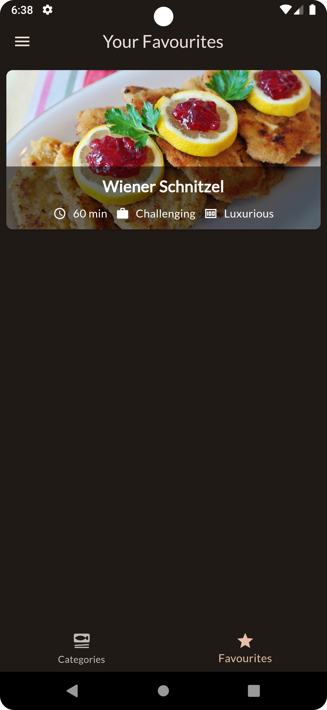
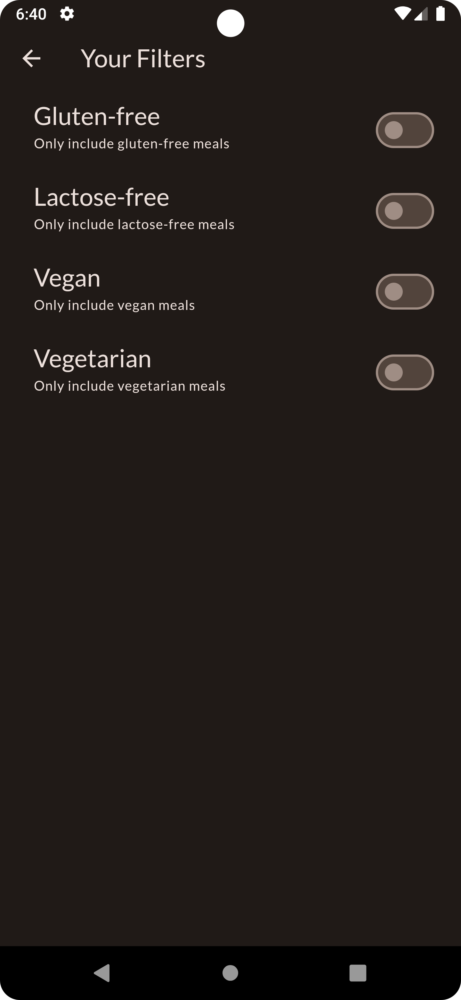
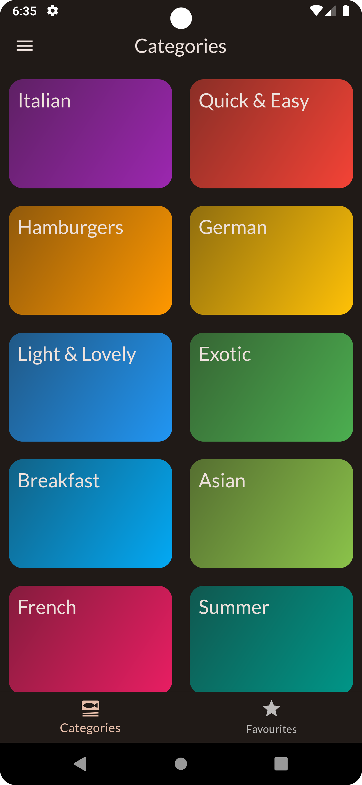
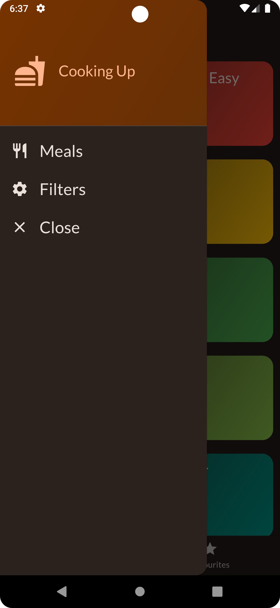

# meals

A simple application for providing recipes for meals

## Application Description
The application has a list of meals that can be filtered by categories and favorites. 
The user can also add meals to favorites and view the details of each meal on a separate screen.
The app has a simple design but rich UI and is intended to demonstrate the power of Flutter and dart.
The application is divided into the following main parts:

## Application Structure
### 1. Data Folder
This folder contains the dummy data used in the application.
It contains dummy data for the following:
- categories
- meals

### 2. Models Folder
This folder contains the models of custom widgets used in the application.
It contains models for the following:
- categories
- meals 

### 3. Screens Folder
This folder contains the screens of the application.
It contains the following:
- main screen
- categories screen
- meals screen
- meal details screen
- filters screen

### 4. Widgets Folder
This folder contains the custom widgets used in the application.
It contains the following custom widgets:
- category grid item
- drawer list item
- meal item
- meal details
- main drawer
- meal item trait

### 5. Providers Folder
This folder contains the providers used in the application.
It contains the following providers:
- meals provider
- filters provider
- favorites meals provider

### 6. Main.dart File
This file contains the main function of the application.
It is the entry point of the application.

### 7. Screenshots
This folder contains the screenshots of the application.

    

        
        
    

    

        
        
    

    

        
        
    

## Getting Started

This project is a starting point for a Flutter application.

A few resources to get you started if this is your first Flutter project:

- [Lab: Write your first Flutter app](https://docs.flutter.dev/get-started/codelab)
- [Cookbook: Useful Flutter samples](https://docs.flutter.dev/cookbook)

For help getting started with Flutter development, view the
[online documentation](https://docs.flutter.dev/), which offers tutorials,
samples, guidance on mobile development, and a full API reference.
